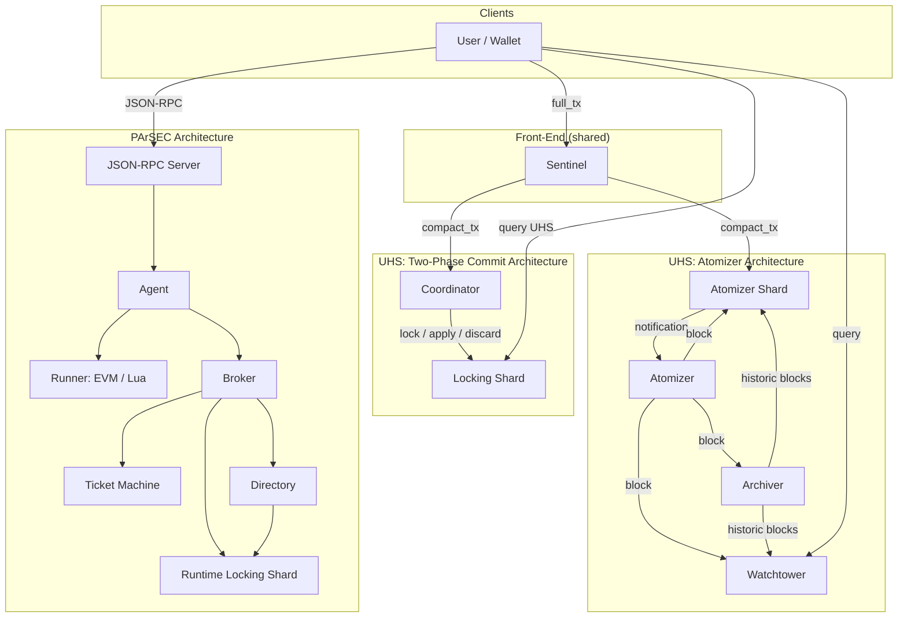
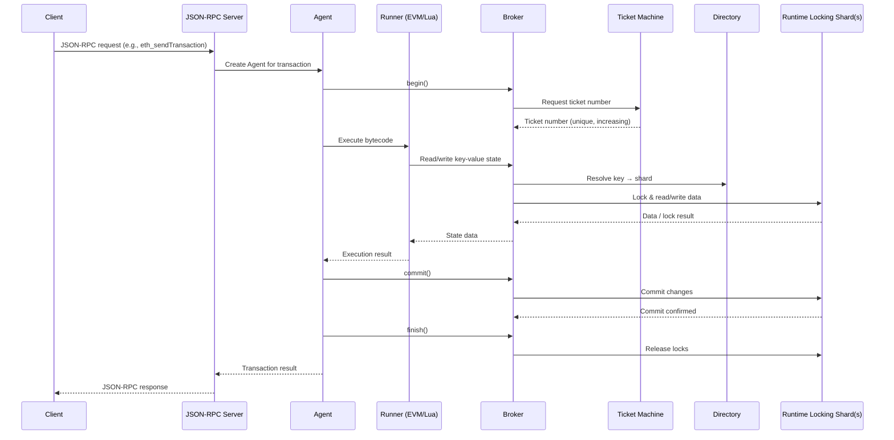

# OpenCBDC Architecture Overview

This document provides a comprehensive overview of the OpenCBDC transaction processing system.
It covers the three architectures — **Atomizer**, **Two-Phase Commit (2PC)**, and **PArSEC** — their shared data model, transaction lifecycles, inter-component data flows, and key trade-offs.

For lower-level details on UHS-based architectures, see [uhs-architectures.md](uhs-architectures.md).
For PArSEC internals, see [parsec_architecture.md](parsec_architecture.md).

---

## Table of Contents

- [High-Level System Diagram](#high-level-system-diagram)
- [Shared Concepts](#shared-concepts)
- [Architecture 1: Atomizer](#architecture-1-atomizer)
- [Architecture 2: Two-Phase Commit (2PC)](#architecture-2-two-phase-commit-2pc)
- [Architecture 3: PArSEC](#architecture-3-parsec)
- [Side-by-Side Comparison](#side-by-side-comparison)
- [Trade-Offs](#trade-offs)

---

## High-Level System Diagram

The diagram below shows every major component across all three architectures and how they relate to one another.



---

## Shared Concepts

### Unspent Hash Set (UHS)

Both the Atomizer and 2PC architectures operate on an **Unspent Hash Set (UHS)** — a set of cryptographic hashes (SHA-256), each representing a spendable output.
Only the hash commitment is stored on-chain; the underlying output data (value, witness program) is held by wallet clients.
This minimizes on-chain state and enhances privacy.

> **Source:** [`src/uhs/transaction/transaction.hpp`](../src/uhs/transaction/transaction.hpp)

### Transaction Data Model

| Type | Description | Key Fields |
|------|-------------|------------|
| `out_point` | Unique identifier of a previous output | `m_tx_id` (hash), `m_index` (uint64) |
| `output` | A new output created by a transaction | `m_witness_program_commitment` (hash), `m_value` (uint64) |
| `input` | An output being spent in a new transaction | `m_prevout` (out_point), `m_prevout_data` (output) |
| `full_tx` | Complete transaction with cryptographic proofs | `m_inputs`, `m_outputs`, `m_witness` |
| `compact_tx` | Hash-only representation for settlement | `m_id`, `m_inputs` (hashes), `m_uhs_outputs` (hashes), `m_attestations` |

### Three-Phase Processing

Transaction processing is split into three decoupled phases:

1. **Validation** — The Sentinel checks transaction-local invariants (signatures, value balance, duplicate inputs) without consulting system state. See `cbdc::transaction::validation::check_tx()`.
2. **Compaction** — The validated `full_tx` is converted to a `compact_tx` containing only hash commitments. The Sentinel signs the compact transaction as an attestation.
3. **Ordering & Settlement** — The compact transaction is ordered relative to others, inputs are verified as unspent, and UHS mutations are applied atomically. This phase differs between Atomizer and 2PC.

---

## Architecture 1: Atomizer

The Atomizer architecture provides **linearizability** by producing a total ordering of all transactions in a sequence of blocks.

### Components

| Component | Replication | Role |
|-----------|-------------|------|
| **Sentinel** | Stateless | Validates `full_tx`, compacts, attests, forwards to Shards |
| **Shard** | Redundant (overlapping prefix ranges) | Stores a prefix-range subset of the UHS; attests input availability to the Atomizer |
| **Atomizer** | Raft cluster | Collects shard attestations; produces ordered blocks at a fixed interval |
| **Archiver** | Standalone | Persists blocks for long-term storage and catch-up |
| **Watchtower** | Standalone | Indexes recent blocks so clients can query transaction status |

### Transaction Lifecycle

```mermaid
sequenceDiagram
    participant C as Client
    participant S as Sentinel
    participant Sh as Shard(s)
    participant A as Atomizer
    participant Ar as Archiver
    participant W as Watchtower

    C->>S: Submit full_tx
    S->>S: Validate (check_tx) & Compact
    S->>Sh: Digest Transaction (compact_tx)
    Sh->>Sh: Check inputs in local UHS
    Sh->>A: Digest Transaction Notification (attestations)
    Note over A: Collect attestations for all inputs
    A->>A: Add tx to current block; mark inputs spent in STXO cache
    A-->>Sh: Broadcast new block
    A-->>Ar: Broadcast new block
    A-->>W: Broadcast new block
    Sh->>Sh: Apply block (delete inputs, add outputs)
    W->>W: Index transactions
    C->>W: Query transaction status
    W-->>C: Confirmed / Error
```

### Data Flow Details

1. **Submission:** Client sends a `full_tx` to any Sentinel.
2. **Validation & Compaction:** Sentinel runs `check_tx()`, produces a `compact_tx`, and signs it (sentinel attestation).
3. **Shard Attestation:** Sentinel sends the `compact_tx` to shards responsible for its input hashes. Each shard checks whether inputs exist in its UHS partition and sends a notification to the Atomizer with an attestation of which inputs are available, along with the block height at which the attestation is valid.
4. **Block Assembly:** Once the Atomizer receives attestations covering every input of a transaction, it adds the transaction to the current block. A new block is emitted at a configurable interval (`target_block_interval`, default 250 ms).
5. **Settlement:** The Atomizer broadcasts the block to Shards, the Archiver, and the Watchtower. Each Shard atomically applies the block — deleting input hashes and adding output hashes to its UHS.
6. **Confirmation:** The client queries the Watchtower for the status of their transaction.

### Error Handling

- If a shard finds that a transaction input is **not** present in its UHS, it sends a "digest error" to the Watchtower.
- If the Atomizer does not receive a full set of attestations before a transaction is evicted from its cache, it also reports an error to the Watchtower.
- If an attestation arrives for an input already in the **STXO (Spent Transaction Output) cache**, the Atomizer reports a double-spend error.

---

## Architecture 2: Two-Phase Commit (2PC)

The 2PC architecture provides **serializability** (but not linearizability) using Conservative Two-Phase Locking (C2PL) distributed across shards.
By removing the global ordering bottleneck, throughput scales horizontally with the number of nodes.

### Components

| Component | Replication | Role |
|-----------|-------------|------|
| **Sentinel** | Stateless | Validates `full_tx`, compacts, attests, forwards to Coordinators |
| **Coordinator** | Raft cluster (multiple clusters for scalability) | Receives `compact_tx` from Sentinels; orchestrates 2PC across Locking Shards |
| **Locking Shard** | Raft cluster | Stores a prefix-range subset of the UHS with per-element locks |

### Transaction Lifecycle

```mermaid
sequenceDiagram
    participant C as Client
    participant S as Sentinel
    participant Co as Coordinator
    participant LS as Locking Shard(s)

    C->>S: Submit full_tx
    S->>S: Validate (check_tx) & Compact
    S->>Co: Execute Transaction (compact_tx)
    Co->>Co: Batch transactions; replicate batch via Raft
    Co->>LS: Phase 1 — Lock (input & output hashes)
    LS->>LS: Lock inputs if present & unlocked
    LS-->>Co: Lock result (which inputs locked)
    Co->>Co: Decide: commit (all locked) or abort; replicate decision
    Co->>LS: Phase 2 — Apply (commit or abort per tx)
    LS->>LS: Commit: delete inputs, add outputs / Abort: unlock inputs
    LS-->>Co: Apply complete
    Co->>LS: Discard (cleanup batch metadata)
    Co-->>S: Transaction result (committed / aborted)
    S-->>C: Result
```

### Data Flow Details

1. **Submission:** Client sends a `full_tx` to any Sentinel.
2. **Validation & Compaction:** Sentinel runs `check_tx()`, produces a `compact_tx` with attestation.
3. **Batching:** The Coordinator adds the transaction to its current batch. Multiple threads execute batches in parallel (configurable via `coordinator_max_threads`, default 75). Once a thread is available, the batch is sealed and assigned a random batch ID.
4. **Phase 1 — Lock:** The Coordinator replicates the batch via Raft, then sends a "lock" RPC to each Locking Shard that holds relevant input or output hashes. The shard atomically locks each requested input hash (if present and unlocked), tagging the lock with the batch ID.
5. **Decision:** The Coordinator combines shard responses. Transactions with all inputs locked are marked for commit; others are marked for abort. This decision is replicated via Raft.
6. **Phase 2 — Apply:** The Coordinator sends an "apply" RPC to each shard. For committed transactions, the shard deletes locked inputs and adds output hashes. For aborted transactions, it releases the locks.
7. **Discard:** After all shards confirm the apply, the Coordinator sends a "discard" RPC, allowing shards to forget the batch. The Coordinator then responds to the Sentinel with the result.
8. **Fault Recovery:** If the Coordinator leader fails, the new Raft leader recovers all in-progress batches from the replicated state machine and restarts each from its last completed step.

### Read-Only Queries

Locking Shards expose a separate read-only interface (`check_unspent`, `check_tx_id`) that allows end-users to query whether a UHS ID is currently unspent or whether a transaction has been completed.

---

## Architecture 3: PArSEC

**PArSEC** (Parallel Architecture for Scalably Executing smart Contracts) adds a programmable execution layer on top of a distributed ACID key-value store.
It supports parallel smart contract execution and is compatible with unmodified Ethereum smart contracts via an EVM runner.

### Components

| Component | Replication | Role |
|-----------|-------------|------|
| **JSON-RPC Server** | Stateless | Ethereum-compatible JSON-RPC API (HTTP); external interface for wallets (MetaMask) and dev tools (Hardhat) |
| **Agent** | Per-transaction | Transaction coordinator; manages the lifecycle of a single transaction by interacting with the Runner and the data store via the Broker |
| **Runner** | Per-agent | Executes smart contract bytecode; two implementations: **EVM** and **Lua** |
| **Broker** | Per-agent | Abstracts the distributed shard set as a single logical database; provides `begin()`, `commit()`, `finish()`, `rollback()` semantics |
| **Ticket Machine** | Raft cluster | Issues globally unique, monotonically increasing ticket numbers for transaction ordering and deadlock resolution |
| **Directory** | Per-broker | Maps each key to the target Shard based on configurable sharding logic |
| **Runtime Locking Shard** | Raft cluster | Distributed key-value store with ACID transactional properties; data is horizontally partitioned across shard instances |

### Transaction Lifecycle



### Data Flow Details

1. **Submission:** External clients (wallets, dApps) send JSON-RPC requests to the JSON-RPC Server.
2. **Agent Creation:** The server instantiates an Agent for each new transaction.
3. **Ticket Assignment:** The Agent, via the Broker, obtains a unique ticket number from the Ticket Machine. This number determines the transaction's relative age for concurrency control and deadlock resolution.
4. **Execution:** The Agent invokes the Runner (EVM or Lua) to execute the smart contract bytecode. During execution, the Runner reads and writes key-value state through the Broker.
5. **State Access:** The Broker uses the Directory to determine which Runtime Locking Shard holds each key, then issues lock and read/write RPCs to the appropriate shard(s).
6. **Commit:** Upon successful execution, the Agent instructs the Broker to commit the transaction. The Broker sends commit RPCs to all involved shards, which atomically apply the writes.
7. **Finish / Rollback:** After commit confirmation, the Agent calls `finish()` to release locks. If execution fails at any point, the Agent calls `rollback()` to release locks and discard pending writes.

### Parallel Execution

PArSEC executes transactions in parallel when their key sets are independent (i.e., they access disjoint sets of keys across shards).
Transactions that access overlapping keys are serialized using the ticket number for ordering and deadlock resolution.
This enables horizontal throughput scaling by adding more shard instances.

---

## Side-by-Side Comparison

| Feature | Atomizer | Two-Phase Commit (2PC) | PArSEC |
|---------|----------|------------------------|--------|
| **Data Model** | UHS (hash commitments) | UHS (hash commitments) | Generic key-value store |
| **Consistency** | Linearizability (total order) | Serializability (relative order) | Serializability (ticket-ordered) |
| **Ordering** | Global block sequence | Per-transaction (no global order) | Ticket numbers |
| **Smart Contracts** | No | No | Yes (EVM, Lua) |
| **Scaling Model** | Vertical (Atomizer is bottleneck) | Horizontal (add coordinators & shards) | Horizontal (add shards; parallel for independent keys) |
| **Fault Tolerance** | Raft-replicated Atomizer; redundant shards with overlapping ranges | Raft-replicated Coordinators and Locking Shards | Raft-replicated Ticket Machine and Runtime Locking Shards |
| **Auditability** | Full block history via Archiver | No materialized history | Application-defined |
| **External Interface** | Custom RPC (Sentinel) | Custom RPC (Sentinel) | Ethereum JSON-RPC (HTTP) |
| **Client Compatibility** | OpenCBDC client-cli | OpenCBDC client-cli | MetaMask, Hardhat, ethers.js, web3.js |

---

## Trade-Offs

| Dimension | Atomizer | Two-Phase Commit (2PC) | PArSEC |
|-----------|----------|------------------------|--------|
| **Peak Throughput** | ~170K tx/s | ~1.7M tx/s | Scales horizontally (key-dependent) |
| **Geo-Replicated Latency** | < 2 seconds | < 1 second | Depends on shard distribution |
| **Complexity** | Moderate — centralized ordering simplifies reasoning | Moderate — distributed locking adds recovery complexity | High — VM layer, ticket ordering, generic KV store |
| **Audit Trail** | Complete — linear block history | None — no materialized transaction history | Application-defined via smart contracts |
| **Privacy** | Strong — only hash commitments stored | Strong — only hash commitments stored | Weaker — full state stored in KV shards |
| **Programmability** | Fixed transaction format | Fixed transaction format | Fully programmable (EVM/Lua smart contracts) |
| **Disaster Recovery** | RTO < 10s, RPO = 0 | RTO < 10s, RPO = 0 | Raft-based recovery |
| **Horizontal Scalability** | Limited by Atomizer throughput | Excellent — add coordinators and shards | Excellent for independent keys; limited by contention for shared keys |

### When to Use Which

- **Atomizer:** Best when a complete, auditable transaction history is required and throughput requirements are under ~170K tx/s. The total ordering simplifies compliance and retroactive auditing.
- **2PC:** Best when maximum throughput and low latency are the primary goals and a materialized transaction history is not needed. Ideal for high-volume payment processing.
- **PArSEC:** Best when smart contract programmability is required. Supports unmodified Ethereum contracts and parallel execution. Suitable for scenarios requiring complex transaction logic beyond simple value transfers.

---

## Source Code Map

| Directory | Description |
|-----------|-------------|
| `src/uhs/transaction/` | Shared transaction data model (`full_tx`, `compact_tx`), validation, wallet |
| `src/uhs/atomizer/` | Atomizer architecture: atomizer, shard, sentinel, archiver, watchtower |
| `src/uhs/twophase/` | 2PC architecture: coordinator, locking shard, sentinel adapter |
| `src/uhs/sentinel/` | Shared sentinel interface and client |
| `src/uhs/client/` | CLI wallet client for both UHS architectures |
| `src/parsec/agent/` | PArSEC agent (transaction coordinator) and runners (EVM, Lua) |
| `src/parsec/broker/` | PArSEC broker (database abstraction) |
| `src/parsec/directory/` | PArSEC directory (key-to-shard mapping) |
| `src/parsec/runtime_locking_shard/` | PArSEC distributed KV store with locking |
| `src/parsec/ticket_machine/` | PArSEC ticket number generator |
| `src/util/common/` | Shared utilities: config, hashing, keys, logging, buffers |
| `src/util/network/` | TCP networking: connection manager, peers, sockets |
| `src/util/raft/` | NuRaft wrappers for Raft consensus |
| `src/util/rpc/` | RPC client/server framework (TCP and HTTP) |
| `src/util/serialization/` | Binary serialization framework |
